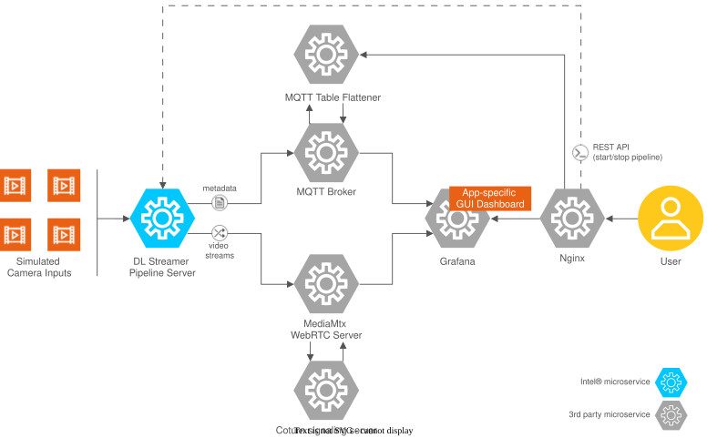

# Loitering Detection

<!--hide_directive
::::{container} component_header_row

  <a class="icon_github" href="https://github.com/open-edge-platform/metro-ai-suite/tree/main/metro-vision-ai-app-recipe/loitering-detection">
     GitHub
  </a>
  <a class="icon_document" href="https://github.com/open-edge-platform/metro-ai-suite/blob/main/metro-vision-ai-app-recipe/loitering-detection/README.md">
     Readme
  </a>
  <a class="icon_download" href="https://github.com/open-edge-platform/metro-ai-suite/blob/main/metro-vision-ai-app-recipe/loitering-detection/docs/user-guide/get-started.md">
     Installation guide
  </a>

hide_directive-->

> [!NOTE]
> This is a sample application **intended for evaluation and development purposes only**.
> For more information, refer to
> [Intended Use](https://docs.openedgeplatform.intel.com/dev/OEP-articles/notes-on-usage.html#intended-use)

<!--hide_directive :::: hide_directive-->

Loitering Detection leverages advanced AI algorithms for monitoring and analyzing real-time
video feeds to demonstrate the efficiency of Intel hardware in AI systems for detecting
individuals lingering in specified areas and recognizing their activity.

By utilizing cutting-edge technologies and pre-trained deep learning models, this application
enables real-time processing and analysis of video streams, making it an ideal solution. Its
modular architecture and integration capabilities ensure that users can easily customize and
extend its functionalities to meet their specific needs.

## Key features

- **Vision Analytics Pipeline:** Detect, track, and classify objects using pre-configured AI
  models, with polygon zone and dwell-time analytics computed natively in the pipeline
  (DL Streamer `gvaanalytics`). Customize parameters such as thresholds and zone polygons
  without requiring additional coding.
- **Integration with MQTT and Grafana:** Facilitates efficient message handling,
  real-time monitoring, and insightful data visualization.
- **User-Friendly:** Simplifies configuration and operation through prebuilt scripts and
  configuration files.

## How it works

The architecture is designed to facilitate seamless integration and operation of various components involved in AI-driven video analytics.

### Components

- **DL Streamer Pipeline Server (VA Pipeline):** Processes video frames, runs object detection and tracking, and computes zone presence and dwell time natively via the `gvaanalytics` element and a reusable `loitering_watermark` overlay element.
- **Mosquitto Message Queuing Telemetry Transport (MQTT) Broker:** Facilitates message communication between the DL Streamer Pipeline Server and Grafana using the MQTT protocol.
- **MQTT Table Flattener:** A small sidecar that reshapes the raw per-frame `object_tracking/<N>` metadata into one-row-per-object `loiter_status/<N>` messages for the Grafana status table (no zone/dwell computation — that remains entirely in `gvaanalytics`).
- **WebRTC Stream Viewer:** Displays real-time video streams processed by the pipeline for end-user visualization.
- **Grafana Dashboard:** A monitoring and visualization tool for analyzing pipeline metrics, logs, and other performance data.
- **Inputs (Video Files and Cameras):** Provide raw video streams or files as input data for processing in the pipeline.
- **Nginx:** High-performance web server and reverse proxy that provides TLS termination and unified HTTPS access.

The DL Streamer Pipeline Server is a core component, designed to handle video analytics at the
edge. It leverages pre-trained deep learning models to perform tasks such as object detection,
classification, and tracking in real-time, and the `gvaanalytics` element evaluates each
tracked object against configurable zone polygons to compute dwell time — adding or editing
zones only requires editing a JSON file, with no pipeline or code changes. This flexibility
ensures that users can deploy AI-driven video analytics solutions quickly and efficiently,
without the need for extensive coding or deep learning expertise.

It integrates MQTT and Grafana to provide a robust and flexible solution for real-time video
inference pipelines. The tool is built to be user-friendly, allowing customization without
the need for extensive coding knowledge. Validate your ideas by developing an end-to-end
solution faster.

<!--hide_directive
:::{toctree}
:hidden:

get-started.md
how-to-guides.md
troubleshooting.md
Release Notes <./release-notes.md>

:::
hide_directive-->
